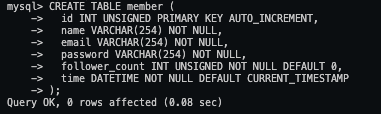

## Task2: Create database and table in your MySQL server

### SQL Statement:

#### Create a new database named website

```
mysql>
CREATE DATABASE website;
```

#### Create a new table named member , in the website database, designed as below:

```
mysql> USE website;
mysql> CREATE TABLE member(
id INT UNSIGNED PRIMARY KEY AUTO_INCREMENT,
name VARCHAR(254) NOT NULL,
email VARCHAR(254) NOT NULL,
password VARCHAR(254) NOT NULL,
follower_count INT UNSIGNED NOT NULL DEFAULT 0,
time DATETIME NOT NULL DEFAULT CURRENT_TIMESTAMP
);
```

### SQL Screenshots:



