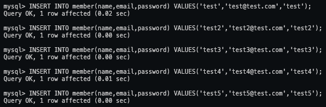
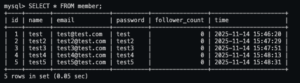
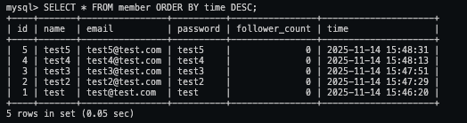
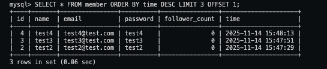
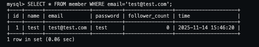
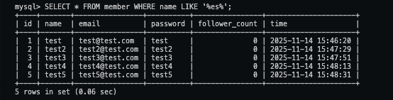
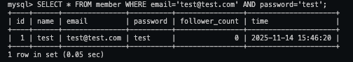
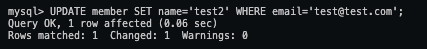

## Task 3: SQL CRUD

### SQL Statements:

#### INSERT a new row to the member table where name, email and password must be set to test , test@test.com , and test . INSERT additional 4 rows with arbitrary data.

```
INSERT INTO member(name,email,password) VALUES('test','test@test.com','test');

INSERT INTO member(name,email,password) VALUES('test2','test2@test.com','test2');

INSERT INTO member(name,email,password) VALUES('test3','test3@test.com','test3');

INSERT INTO member(name,email,password) VALUES('test4','test4@test.com','test4');

INSERT INTO member(name,email,password) VALUES('test5','test5@test.com','test5');
```

#### SELECT all rows from the member table.

```
SELECT * FROM member;
```

#### SELECT all rows from the member table, in descending order of time.

```
SELECT * FROM member ORDER BY time DESC;
```

#### SELECT total 3 rows, second to fourth, from the member table, in descending order of time.

```
SELECT * FROM member ORDER BY time DESC LIMIT 3 OFFSET 1;
```

#### SELECT rows where email equals to test@test.com

```
SELECT * FROM member WHERE email='test@test.com';
```

#### SELECT rows where name includes the es keyword.

```
SELECT * FROM member WHERE name LIKE '%es%';
```

#### SELECT rows where email equals to test@test.com and password equals to test .

```
SELECT * FROM member WHERE email='test@test.com' AND password='test';
```

#### UPDATE data in name column to test2 where email equals to test@test.com .

```
UPDATE member SET name='test2' WHERE email='test@test.com';
```

### SQL Screenshots:









