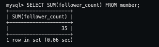
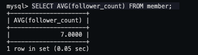
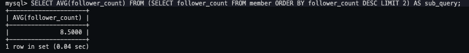

## Task 4: SQL Aggregation Functions

### SQL Statements:

#### SELECT how many rows from the member table.

```
SELECT COUNT(*) FROM member;
```

#### SELECT the sum of follower_count of all the rows from the member table.

```
SELECT SUM(follower_count) FROM member;
```

#### SELECT the average of follower_count of all the rows from the member table.

```
SELECT AVG(follower_count) FROM member;
```

#### SELECT the average of follower_count of the first 2 rows, in descending order of follower_count, from the member table.

```
SELECT AVG(follower_count) FROM (SELECT follower_count FROM member ORDER BY follower_count DESC LIMIT 2) AS sub_query;
```

### SQL Screenshots:





