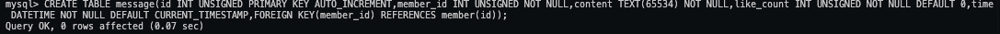
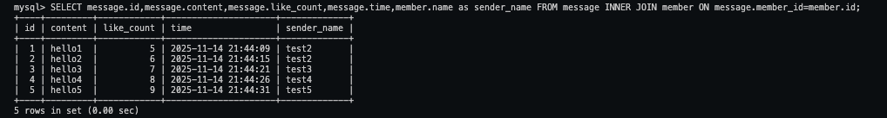
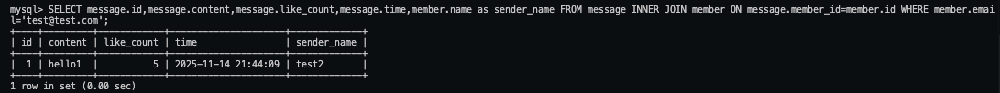
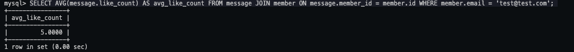
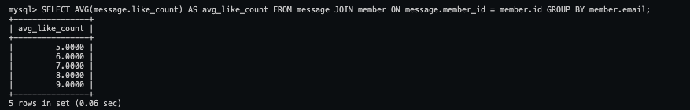

## Task 5: SQL JOIN

### SQL Statements:

#### Create a new table named message , in the website database.

```
CREATE TABLE message(id INT UNSIGNED PRIMARY KEY AUTO_INCREMENT,member_id INT UNSIGNED NOT NULL,content TEXT(65534) NOT NULL,like_count INT UNSIGNED NOT NULL DEFAULT 0,time DATETIME NOT NULL DEFAULT CURRENT_TIMESTAMP,FOREIGN KEY(member_id) REFERENCES member(id));
```

#### SELECT all messages, including sender names. We have to JOIN the member table to get that.

```
SELECT message.id,message.content,message.like_count,message.time,member.name as sender_name FROM message INNER JOIN member ON message.member_id=member.id;
```

#### SELECT all messages, including sender names, where sender email equals to test@test.com . We have to JOIN the member table to filter and get that.

```
SELECT message.id,message.content,message.like_count,message.time,member.name as sender_name FROM message INNER JOIN member ON message.member_id=member.id WHERE member.email='test@test.com';
```

#### Use SELECT, SQL Aggregation Functions with JOIN statement, get the average like count of messages where sender email equals to test@test.com .

```
SELECT AVG(message.like_count) AS avg_like_count FROM message JOIN member ON message.member_id = member.id WHERE member.email = 'test@test.com';
```

#### Use SELECT, SQL Aggregation Functions with JOIN statement, get the average like count of messages GROUP BY sender email

```
SELECT AVG(message.like_count) AS avg_like_count FROM message JOIN member ON message.member_id = member.id GROUP BY member.email;
```

### SQL Screenshots:






